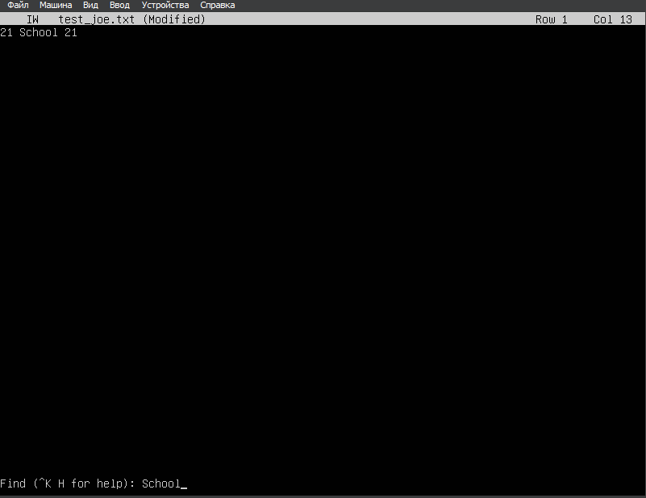
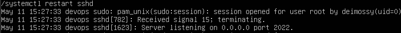

# Операционные системы UNIX/Linux (Базовый).
1. [Установка ОС](#Part_1)
2. [Создание пользователя](#Part_2)
3. [Настройка сети ОС](#Part_3)
4. [Обновление ОС](#Part_4)
5. [Использование команды sudo](#Part_5)
6. [Установка и настройка службы времени](#Part_6)
7. [Установка и использование текстовых редакторов](#Part_7)
8. [Установка и базовая настройка сервиса SSHD](#Part_8)
9. [Установка и использование утилит top, htop](#Part_9)
10. [Использование утилиты fdisk](#Part_10)
11. [Использование утилиты df](#Part_11)
12. [Использование утилиты du](#Part_12)
13. [Установка и использование утилиты ncdu](#Part_13)
14. [Работа с системными журналами](#Part_14)
15. [Использование планировщика заданий CRON](#Part_15)

<h2 id="Part_1">Part 1. Установка ОС</h2>

Чтобы узнать версию Ubuntu вводим команду: `cat /etc/issue`

<h2 id="Part_2">Part 2. Создание пользователя</h2>

Для создания пользователя служит команда *useradd*. 

Создаем пользователя, отличного от созданного при установке и добавляем его в группу **adm**

Проверяем создание нового пользователя в указанной группе:

<h2 id="Part_3">Part 3. Настройка сети ОС</h2>

### 1. Задаем название машины **user-1** 
Используем команду `hostnamectl set-hostname user-1`

### 2. Устанавливаем временную зону, соответствующую нашему местоположению
Используем команду `sudo timedatectl set-timezone Etc/GMT+5`

### 3. Выводим названия сетевых интерфейсов с помощью консольной команды
 

- lo (loopback device) – виртуальный интерфейс, присутствующий по умолчанию в любом Linux. Он используется для отладки сетевых программ и запуска серверных приложений на локальной машине. С этим интерфейсом всегда связан адрес 127.0.0.1. У него есть dns-имя – localhost. Посмотреть привязку можно в файле */etc/hosts*.

### 4. Используя консольную команду, получаем ip адрес текущего устройства от DHCP сервера

- DHCP (Dynamic Host Configuration Protocol) - протокол динамической настройки узла

### 5. Определяем и выводим на экран внешний и внутренний ip-адрес шлюза

Внутренний ip узнаем через команду: `ip addr` или `ip a`

Внешний ip и внутренний ip узнаем через команду: `ip r` или `ip route`

 
 - Внешний ip: **10.0.2.2**
 - Внутренний ip: **10.0.2.15**

### 6. Задаем статичные настройки ip, gw, dns (используем публичные DNS серверы)
Для этого находим файл конфигурации Netplan. Обычно он находится в `/etc/netplan/` и имеет расширение `.yaml`

 

Редактируем файл через `sudo vim 00-installer-config.yaml`:

1. Файл до редактирования:

    

2. Файл после редактирования:

    

Далее сохраняем отредактированный файл (командой в vim'е `:wq`) и применяем команду `sudo netplan apply`

### 7. Перезагружаем виртуальную машину для проверки заданных значений статичных сетевых настроек

Выполняем команду `sudo reboot` и пингуем удаленные хосты 1.1.1.1 и ya.ru

<h2 id="Part_4">Part 4. Обновление ОС</h2>

Для обновления пакетов пишем в терминал команду: `sudo apt upgrade`. После обновления вводим команду еще раз:

<h2 id="Part_5">Part 5. Использование команды sudo</h2>

Команда **sudo** расшифровывается как **"SuperUser DO"** (дословно - «выполнить от имени суперпользователя») или, по другой версии, **"substitute user and do"** - «подменить пользователя и выполнить». Она позволяет пользователю временно получить права суперпользователя (root) или другого пользователя для выполнения команд, требующих повышенных привилегий

Добавляем созданного пользователя в группу *sudo*: `sudo usermod -aG sudo user1_adm`

- Опция -aG означает добавить (-a - append) пользователя в одну или несколько дополнительных групп (-G - groups), не удаляя его из уже существующих групп

- Второе sudo - имя группы, в которую добавляется пользователь

Меняем hostname ОС от имени этого пользователя:
 - Переключаемся на созданного пользователя командой `su - user1_adm`
 - Меняем название на *s21* командой `sudo hostnamectl set-hostname s21` и переключаемся на "нашего" пользователя для проверки изменения hostname (также можно ввести команды `hostname` или `hostnamectl`)

<h2 id="Part_6">Part 6. Установка и настройка службы времени</h2>

Включаем автоматическую синхронизацию времени с удаленными серверами NTP: `sudo timedatectl set-ntp true`

Выводим время часового пояса, в котором мы сейчас находимся: `timedatectl show`

<h2 id="Part_7">Part 7. Установка и использование текстовых редакторов</h2>

Устанавливаем текстовые редакторы **Vim**, **Nano** и **Joe**:

  `sudo apt install vim`

  `sudo apt install nano`

  `sudoapt install joe`

После успешного скачивания:

1. Создаем файл *test_X.txt*, где Х - название редактора. Записываем свой никнейм и зарываем файл с сохранением изменений:
    - Vim
        - Нажимаем `i` (insert) для перехода в режим редактирования.
        - Пишем никнейм **deimossy**
        - Выходим из режима вставки, нажав `esc`
        - Пишем `:wq` для закрытия файла с сохранением

            

    - Nano
        - Пишем никнейм **deimossy**
        - Для сохранения нажимаем `ctrl + s`
        - Для выхода нажимаем `ctrl + x`
        
            

    - Joe
        - Пишем никнейм **deimossy**
        - Для сохранения нажимаем `ctrl + k - w`
        - Подверждаем сохранение, нажав `enter`
        - Нажимаем `ctrl + c` для выхода

            

2. Редактируем файлы, заменив никнейм на "**21 School 21**" и закрываем файлы без сохранения изменений
    - Vim
        - Нажимаем `i` (insert) для перехода в режим редактирования.
        - Записываем *21 School 21*.
        - Выходим из режима вставки, нажав `esc`
        - Пишем `:q!` для закрытия файла без сохранения

            

    - Nano
        - Пишем *21 School 21*
        - Для выхода нажимаем `ctrl + x`
        - Подтверждаем выход без сохранения, нажав `n`

            

    - Joe
        - Пишем *21 School 21*
        - Нажимаем `ctrl + c` для выхода
        - Подтверждаем выход без сохранения, нажав `y`
        
            

3. Редактируем файлы ещё раз (по аналогии с предыдущим пунктом), а затем с помощью функции поиска по содержимому файла заменяем искомое слово на любое другое
    - Vim
        - Нажимаем `i` (insert) для перехода в режим редактирования.
        - Записываем *21 School 21*.
        - Выходим из режима вставки, нажав `esc`
        - Пишем `/School`

            

        - Пишем `:s/School/deimossy`
        - Пишем `:wq` для закрытия файла с сохранением
        
            

    - Nano
        - Пишем *21 School 21*
        - Для поиска нажимаем `ctrl + w`

            

        - Пишем `ctrl + \`, вводим искомое слово `21` и затем вводим заменяющее слово `deimossy` и указываем замену всего нажатием `a`

            

        - Для сохранения нажимаем `ctrl + s`
        - Для выхода нажимаем `ctrl + x`

    - Joe
        - Пишем *21 School 21*
        - Для поиска нажимаем `ctrl + k - f`

            
        
        - Чтобы заменить слово сразу пишем `r` и в следуещей строке пишем слово, на которое нужно заменить искомое слово `21` и подтверждаем замену введя `y`
        - И при выходе из файла подтверждаем сохранение файла `y`

            

<h2 id="Part_8">Part 8. Установка и базовая настройка сервиса SSHD</h2>

Для установки службы SSH пишем команду: `sudo apt install openssh-server`

Для автостарта службы при загрузке системы используем команду **enable**: `sudo systemctl enable ssh`

Убеждаемся в том, что служба автостарта активирована

Перенастраиваем службу SSHd на другой порт путем редактирования файла конфигураций SSHd (/etc/ssh/sshd_config)

Для применения сделанных настроек перезапускаем SSH-сервер командой `sudo systemctl restart ssh`

Проверяем наличие процесса sshd через команду `ps` (показывает активные процессы системы и информацию о них) с флагами `-e` (отображает все процессы на системе, эквивалентно `-A`) и `-f` (показывает больше информации о каждом процессе)

Перезагружаем систему командой `sudo reboot`

Проверяем сетевую конфигурацию командой `netstat -tan`
  - `-t` или `--tcp` - отображает TCP соединения
  - `-a` или `--all` - показывает все соединения
  - `-n` или `--numeric` - отображает адреса и номера портов в числовом формате

  - *Proto* - протокол соединения
  - *Rec-Q* - количеству байтов данных, которые ожидают обработки в очередях приема
  - *Send-Q* -  количеству байтов данных, которые ожидают обработки в очередях отправки
  - *Local Address* - локальный адрес и порт (<ip-адрес>:<порт>)
  - *Foreign Address* - удаленный адрес и порт (<ip-адрес>:<порт>)
  - *State* - состояние соединения

Значение 0.0.0.0 в контексте сетевого программирования и конфишурации сетевых сервисов используется для обозначения "любого" или "всех" IP-адресов, доступных на машине

<h2 id="Part_9">Part 9. Установка и использование утилит top, htop</h2>

Утилита **top** предустановлена во всех дистрибутивах Linux и не требует отдельной установки

Устанавливаем утилиту **htop**: `sudo apt install htop`

- Вывод утилиты **top**

    
    
    * uptime: 10 min
    * Количество авторизованных пользователей: 1 (deimossy)
    * Общая загрузка системы (1/5/15 min): 0.00 / 0.01 / 0.00
    * Общее количество процессов (Tasks): 131
    * Загрузка cpu: 0.0 us (пользовательские процессы), 0.1 sy (процессы ядра), 99.8 id (неиспользуемые ресурсы), 0.1 wa (операции ввода/вывода, т.е. дисковые операции)
    * Mem/Swap: 3919.2/0.0 (общий объем), 3346.5/0.0 (свободная память), 175/0.0 (использованная память)
    * pid процесса, занимающего больше всего памяти: **746** (нажимаем `M`)
    * pid процесса, занимающего больше всего процессорного времени: **154** (используется по умолчания, но можно нажать `P`)

- Отсортированный вывод команды **htop**:

    - по **PID**

        

    - по **PERCENT_CPU**

        

    - по **PERCENT_MEM**

        
    
    - по **TIME**

        

- Отфильтрованный вывод команды **htop** для процесса **sshd**:

    

- Вывод **htop** с процессом *syslog*, используя поиск

    

- Вывод **htop** с добавленным выводом *hostname*, *clock* и *uptime*

    Для этого заходим в настройки (`f2`), выбираем подменю `Meters` и добавляем в `Right column` для отображения следующие столбцы: *Hostname*, *Clock* и *Uptime*
    
    *Отображается в верхнем окне, в правой нижней части

    

<h2 id="Part_10">Part 10. Использование утилиты fdisk</h2>

Запускаем команду `sudo fdisk -l`

Из вывода команды можно заключить, что:
  * ЖД называется **dev/sda** (dev/sda3)
  * ЖД имеет размер **5.5 Gb** и **10586688** секторов
  * Раздел подкачи реализован как файл на одном из разделов, а не как отдельный раздел и имеет название **/dev/sda2** и его размер составляет **2 Gb**. Для уточнения информации о **swap** в этом случае используем команду `swapon --show`:

    

    Раздел подкачки (swap) в данной системе отсутствует, хотя на диске есть раздел /dev/sda2 размером 2 ГБ, который используется как обычный раздел файловой системы, а не как swap. Команды swapon --show и cat /proc/swaps подтверждают, что swap не активен. Это не является ошибкой, если объёма оперативной памяти достаточно для работы системы

<h2 id="Part_11">Part 11. Использование утилиты df</h2>

Для получения подробного отчета об использовании дискового пространства для корневого раздела системы (/) используем команду `df /`

  * Размер раздела: 3321332
  * Размер занятого пространства: 2797180
  * Размер свободного пространства: 335124
  * Процент использования: 90

Единица измерения: 1K-blocks (блоки по 1 килобайту)

Чтобы получить информацию о дисковом пространстве для всех смонтированных файловых систем пишем команду `df -Th`

Для определения корневого раздела ищем строку, где в столбце *Mounted on* указано **/**. Это информация о корневом разделе

  * Размер раздела: 3.2G
  * Размер занятого пространства: 2.7G
  * Размер свободного пространства: 328M
  * Процент использования: 90

Тип файловой системы для раздела - **ext4**

<h2 id="Part_12">Part 12. Использование утилиты du</h2>

Используя команду `du`

  * выводим размер папки **/home**

    

  * выводим размер папки **/var**

    

  * выводим размер папки **/var/log**

    

  * выводим размер всего содержимого в **/var/log**

    

<h2 id="Part_13">Part 13. Установка и использование утилиты ncdu</h2>

Устанавливаем **ncdu** командой `sudo apt-get install ncdu`

Используя команду **ncdu**

  * выводим размер папки **/home**

    

  * выводим размер папки **/var**

    

  * выводим размер папки **/var/log**

    

<h2 id="Part_14">Part 14. Работа с системными журналами</h2>

Открываем для просмотра:

  1. **/var/log/dmesg**
  2. **/var/log/syslog**
  3. **/var/log/auth.log**

чтобы найти время последней успешной авторизации, имя пользователя и метод входа в систему

* Последняя успешная авторизация: *May 11 15:20:39*
* Имя пользователя: *deimossy*
* Метод входа в систему: *LOGIN*

Перезапускаем службу SSHd командой `sudo systemctl restart sshd` и ищем информацию о рестарте в логах

<h2 id="Part_15">Part 15. Использование планировщика заданий CRON</h2>

Для работы **cron** нужен *crontab-файл*. По умолчанию он не существует, поэтому создвем его вручную командой `crontab -e`, выбираем **vim basic** и добавляем запись.

Редактируем с помощью vim список текущих заданий для **cron**:

Проверяем работу **cron**'а через логи командой `tail -n 100 /var/log/syslog`:

Удаляем все задачи из **cron**'а командой `crontab -e` (также можно использовать команду `crontab -r`). Автоматически переходим в вим, удаляем запись и выходим с сохранением.

Вывод команды `crontab -l`:

